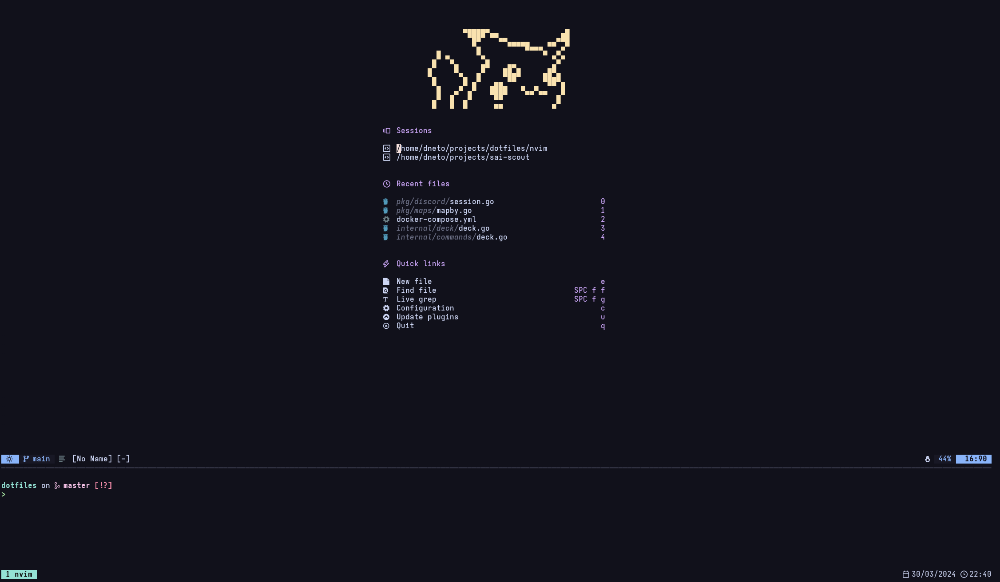
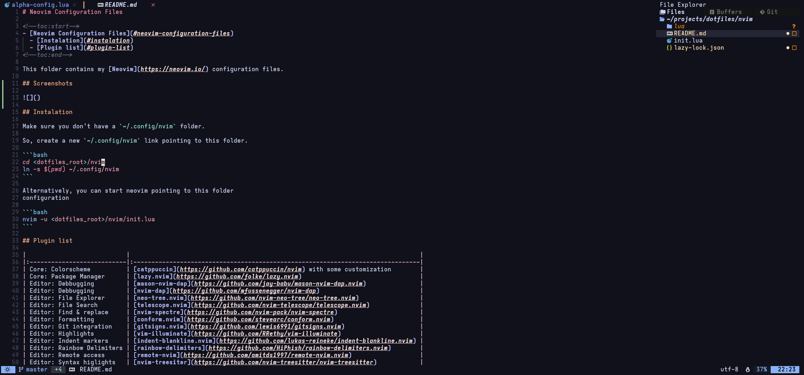

# Neovim Configuration Files

<!--toc:start-->
- [Neovim Configuration Files](#neovim-configuration-files)
  - [Instalation](#instalation)
  - [Plugin list](#plugin-list)
<!--toc:end-->

This folder contains my [Neovim](https://neovim.io/) configuration files.

## Screenshots




## Instalation

Make sure you don't have a `~/.config/nvim` folder.

So, create a new `~/.config/nvim` link pointing to this folder.

```bash
cd <dotfiles_root>/nvim
ln -s $(pwd) ~/.config/nvim
```

Alternatively, you can start neovim pointing to this folder
configuration

```bash
nvim -u <dotfiles_root>/nvim/init.lua
```

## Plugin list

|                            |                                                                                 |
|:---------------------------|:--------------------------------------------------------------------------------|
| Core: Colorscheme          | [catppuccin](https://github.com/catppuccin/nvim) with some customization        | 
| Core: Package Manager      | [lazy.nvim](https://github.com/folke/lazy.nvim)                                 |
| Editor: Debbugging         | [mason-nvim-dap](https://github.com/jay-babu/mason-nvim-dap.nvim)               |
| Editor: Debbugging         | [nvim-dap](https://github.com/mfussenegger/nvim-dap)                            |
| Editor: File Explorer      | [neo-tree.nvim](https://github.com/nvim-neo-tree/neo-tree.nvim)                 |
| Editor: File Search        | [telescope.nvim](https://github.com/nvim-telescope/telescope.nvim)              |
| Editor: Find & replace     | [nvim-spectre](https://github.com/nvim-pack/nvim-spectre)                       |
| Editor: Formatting         | [conform.nvim](https://github.com/stevearc/conform.nvim)                        |
| Editor: Git integration    | [gitsigns.nvim](https://github.com/lewis6991/gitsigns.nvim)                     |
| Editor: Highlights         | [vim-illuminate](https://github.com/RRethy/vim-illuminate)                      |
| Editor: Indent markers     | [indent-blankline.nvim](https://github.com/lukas-reineke/indent-blankline.nvim) |
| Editor: Rainbow Delimiters | [rainbow-delimiters](https://github.com/HiPhish/rainbow-delimiters.nvim)        |
| Editor: Remote access      | [remote-nvim](https://github.com/amitds1997/remote-nvim.nvim)                   |
| Editor: Syntax higlights   | [nvim-treesiter](https://github.com/nvim-treesitter/nvim-treesitter)            |
| LSP: Configuration         | [mason-lspconfig.nvim](https://github.com/williamboman/mason-lspconfig.nvim)    |
| LSP: Configuration         | [mason.nvim](https://github.com/williamboman/mason.nvim)                        |
| LSP: Configuration         | [nvim-lspconfig](https://github.com/neovim/nvim-lspconfig)                      |
| LSP: Languages (Go)        | [mason.nvim](https://github.com/williamboman/mason.nvim)                        |
| UI: Components             | [dressing.nvim](https://github.com/stevearc/dressing.nvim)                      |
| UI: Components             | [noice](https://github.com/stevearc/dressing.nvim)                              |
| UI: Start page             | [alpha-nvim](https://github.com/goolord/alpha-nvim)                             |
| UI: Status Line            | [lualine.nvim](https://github.com/nvim-lualine/lualine.nvim)                    |
| UI: Tabs                   | [bufferline.nvim](https://github.com/akinsho/bufferline.nvim)                   |
